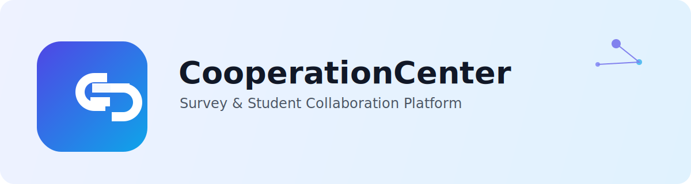
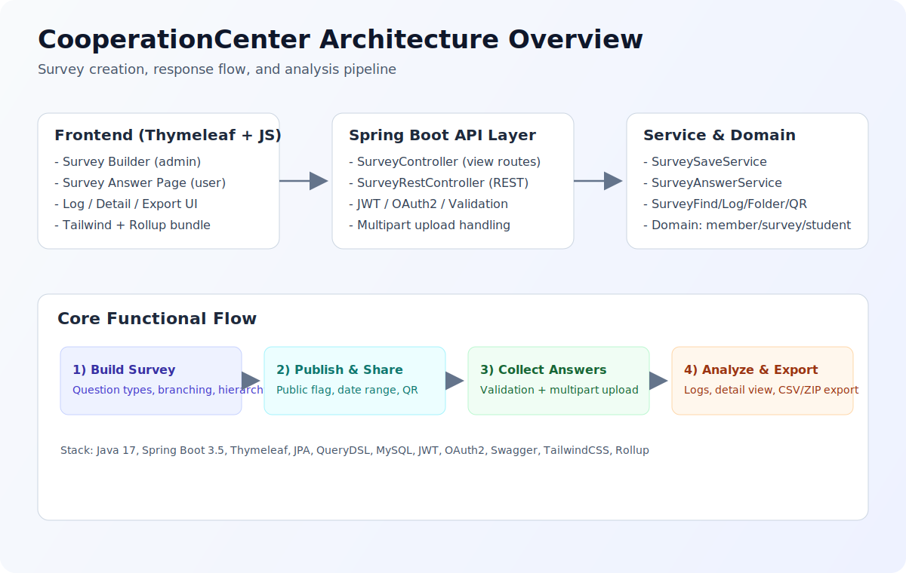
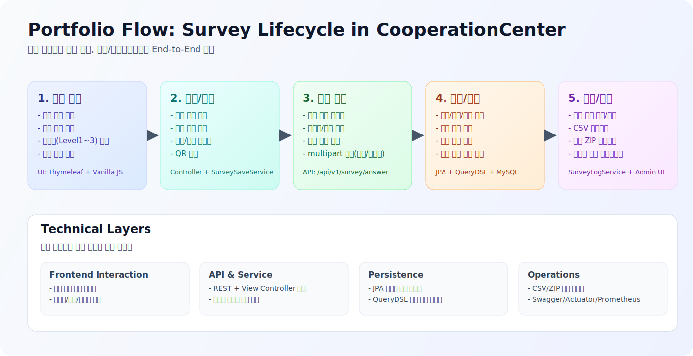
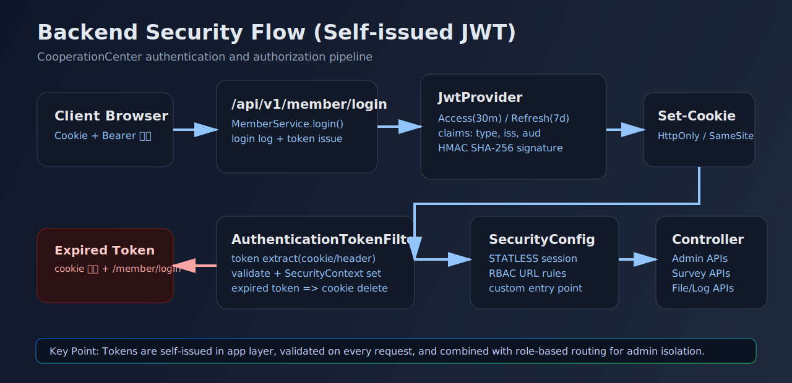

# CooperationCenter



설문 생성부터 응답 수집, 로그/파일 내보내기, 학생 데이터 전환까지 연결한 운영형 플랫폼입니다.

## 프로젝트 이미지





## 프로젝트 핵심 요약

- 관리자/사용자 분리형 설문 플랫폼 (Spring Boot + Thymeleaf)
- 복잡한 분기/계층형 문항을 지원하는 설문 엔진
- 응답 로그, CSV/ZIP 내보내기, 파일 업로드/다운로드까지 운영 기능 포함
- 설문 응답을 학생 도메인 데이터로 매핑하는 업무 자동화 로직 포함

## 백엔드 기술적 차별점 (포트폴리오 핵심)

### 1) 자체 JWT 발급/검증 파이프라인

외부 인증 서버에 의존하지 않고 애플리케이션 레이어에서 토큰을 직접 발급/검증합니다.

- `JwtProvider`에서 Access/Refresh 토큰 생성
- `HmacSHA256` 서명 + `issuer/audience/type` 클레임 구성
- Access 30분, Refresh 7일 만료 정책 분리
- `AuthenticationTokenFilter`에서 매 요청 검증 후 `SecurityContext` 구성

근거 코드:

- `src/main/java/com/cooperation/project/cooperationcenter/global/token/JwtProvider.java`
- `src/main/java/com/cooperation/project/cooperationcenter/global/token/JwtProperties.java`
- `src/main/java/com/cooperation/project/cooperationcenter/global/filter/AuthenticationTokenFilter.java`

### 2) Access/Refresh 분리 + 쿠키 기반 보안 전송

토큰 저장은 쿠키 전략을 사용하고, 재발급 API를 분리했습니다.

- 로그인 시 Access/Refresh 쿠키 동시 발급
- `HttpOnly` + `SameSite=Lax` 설정으로 스크립트 접근/CSRF 리스크 완화
- Access 만료 시 `/api/v1/member/refresh`로 재발급
- 만료/오류 시 쿠키 즉시 삭제 후 로그인 페이지로 유도

근거 코드:

- `src/main/java/com/cooperation/project/cooperationcenter/domain/member/service/MemberService.java`
- `src/main/java/com/cooperation/project/cooperationcenter/domain/member/service/MemberCookieService.java`
- `src/main/java/com/cooperation/project/cooperationcenter/domain/member/controller/homepage/MemberRestController.java`

### 3) Stateless 보안 체인 + URL 단위 RBAC

Spring Security 필터 체인을 세션 비저장 방식으로 구성하고, 관리자 경로를 URL 레벨에서 격리했습니다.

- `SessionCreationPolicy.STATELESS`
- 커스텀 토큰 필터를 `UsernamePasswordAuthenticationFilter` 앞단에 배치
- `/admin/**`, `/api/v1/survey/admin/**` 등 관리자 전용 경로에 `ROLE_ADMIN` 강제
- 인증 실패 시 사용자/관리자 로그인 경로를 분리 리다이렉트

근거 코드:

- `src/main/java/com/cooperation/project/cooperationcenter/global/config/SecurityConfig.java`
- `src/main/java/com/cooperation/project/cooperationcenter/global/filter/CustomAuthenticationEntryPoint.java`

### 4) 운영 데이터 안정성: Soft Delete + 수정 동기화

데이터 삭제/수정 시 운영 안정성을 위한 보존 전략을 넣었습니다.

- 주요 엔티티에 `@SQLDelete`, `@SQLRestriction` 적용
- 설문 수정 시 기존 문항과 제출 문항 ID를 비교해 제거 대상만 정리 (`deleteRemovedQuestions`)
- 응답/문항/옵션 간 연관 데이터 정합성 유지

근거 코드:

- `src/main/java/com/cooperation/project/cooperationcenter/domain/survey/service/homepage/SurveySaveService.java`
- `src/main/java/com/cooperation/project/cooperationcenter/domain/survey/model/Survey.java`
- `src/main/java/com/cooperation/project/cooperationcenter/domain/survey/model/Question.java`
- `src/main/java/com/cooperation/project/cooperationcenter/domain/survey/model/QuestionOption.java`

### 5) 대용량 응답 처리: 스트리밍 다운로드

응답 로그/파일 내보내기를 `StreamingResponseBody`로 구현해 메모리 점유를 제어했습니다.

- CSV 스트리밍 생성 (BOM 포함)
- ZIP 스트리밍 생성 (설문/학생 기준 파일 묶음)
- CSV Injection 방지 처리(수식 시작 문자 보호)

근거 코드:

- `src/main/java/com/cooperation/project/cooperationcenter/domain/survey/service/homepage/SurveyLogService.java`

### 6) 파일 보안 전략: Presigned URL + OSS 서버측 암호화

파일은 객체 저장소 기반으로 다루고, 직접 노출 대신 서명 URL을 발급합니다.

- Presigned URL로 조회/다운로드 TTL 제어
- 업로드 시 `x-oss-server-side-encryption: AES256` 적용
- 파일명 개행 제거 등 기본 입력 정제 적용

근거 코드:

- `src/main/java/com/cooperation/project/cooperationcenter/domain/file/service/FileService.java`
- `src/main/java/com/cooperation/project/cooperationcenter/domain/oss/OssService.java`
- `src/main/java/com/cooperation/project/cooperationcenter/domain/file/model/FileAttachment.java`

### 7) QueryDSL 기반 조건 검색

운영 화면의 복합 검색을 QueryDSL로 구현해 조건 조합과 페이지네이션을 처리합니다.

- 회원 검색: 상태/키워드/기간 조합
- 학생 검색: 이름/성별/생년월일/여권/시험번호/유학원 조합

근거 코드:

- `src/main/java/com/cooperation/project/cooperationcenter/domain/member/repository/MemberRepositoryImpl.java`
- `src/main/java/com/cooperation/project/cooperationcenter/domain/student/repository/StudentRepositoryImpl.java`

## 주요 기능

### 설문 관리 (Admin)

- 설문 생성/수정/삭제/복사
- 계층형(Level1~3) 문항 및 분기 문항 구성
- 설문 폴더 관리, 공개 여부 제어

### 설문 응답 (User)

- 설문 상세 로딩 및 동적 문항 렌더링
- 날짜/텍스트/객관식/파일/이미지 입력 지원
- 응답 기간 검증 후 제출

### 운영/분석

- 응답 로그 목록/상세 조회
- CSV 내보내기
- 파일 ZIP 내보내기
- QR 생성

## 기술 스택

- Backend: Java 17, Spring Boot 3.5, Spring MVC, Spring Security, Spring Data JPA
- Query: QueryDSL
- Template: Thymeleaf
- Database: MySQL
- Storage: Alibaba OSS
- API Docs: Springdoc OpenAPI (Swagger)
- Observability: Actuator, Prometheus
- Frontend Build: Rollup, TailwindCSS, Babel
- Test: JUnit5, Mockito, Testcontainers

## 실행 방법

### 1) 프론트 의존성 설치

```bash
npm ci
```

### 2) 애플리케이션 실행 (local)

```bash
./gradlew bootRun --args='--spring.profiles.active=local'
```

Windows:

```powershell
.\gradlew.bat bootRun --args="--spring.profiles.active=local"
```

## 주요 환경 변수

- DB: `DB_HOST`, `DB_PORT`, `DB_NAME`, `DB_USERNAME`, `DB_PASSWORD`
- JWT: `JWT_SECRET`
- OSS: `OSS_ACCESS_END_POINT`, `OSS_ACCESS_BUCKET_NAME`, `OSS_ACCESS_KEY_ID`, `OSS_ACCESS_KEY_SECRET`
- Mail: `MAIL_USERNAME`, `MAIL_PASSWORD`, `MALIGUN_DOMAIN`, `MALIGUN_APIKEY`, `MALIGUN_FROMEMAIL`
- API Key: `TENCENT_API_KEY`

## 테스트

```bash
./gradlew test
```

Windows:

```powershell
.\gradlew.bat test
```

## 포트폴리오 발표 포인트

- 설문 도메인 복잡도(계층형/분기형)를 데이터 모델과 API로 일관되게 설계한 경험
- 자체 JWT 발급/검증, 재발급, 필터 체인 기반 인증 구조를 직접 구축한 경험
- 대용량 다운로드를 스트리밍으로 전환해 운영 안정성을 고려한 백엔드 설계 경험
- 설문 응답을 학생 도메인으로 자동 매핑해 실제 업무 플로우를 단축한 경험
